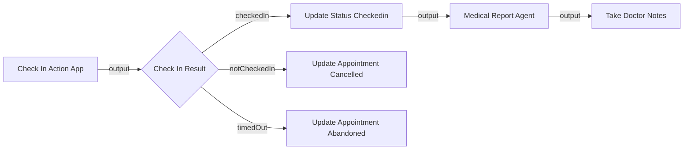

# ConsultationSystem — Flow Architecture Plan

Source: `agentic_consultation_management.bpmn` (Agentic Consultation Management Process)
Target: UiPath Maestro Flow project `AgenticConsultationManagement` inside solution `ConsultationSystem`.

## 1. Summary

The flow manages a patient consultation end-to-end: a booking request triggers an agent that schedules a time slot, records are fetched from Data Fabric, and a confirmation mail is sent. The flow then waits (script-based polling loop) for one of three events — a doctor emergency, a patient reschedule/cancel, or the final reminder on appointment day. On appointment day, a Day-Of-Consultation subflow handles check-in, the Medical Report Agent, and doctor notes, followed by optional lab-test and pharmacy-order tasks before the appointment is marked completed.

**First-pass decisions (as agreed):**

- **All external interactions are `core.logic.mock` placeholders** — mail moves/sends, Data Fabric reads/writes, the three agents (Booking, Analyse-Reply, Medical Report), and all Action-App human tasks (Check-In, Doctor Notes, Lab Test, Pharmacy Order). They will later be replaced by connector nodes, inline agents (`uipath.agent.autonomous`), and HITL nodes.
- **BPMN event-based gateways → script-based polling loops**: each "wait for event" is a `core.logic.loop` iterating poll attempts, whose body is a `core.logic.delay` (poll interval) + `core.action.script` (checks for the event; mocked to return an event immediately for now). A downstream switch/decision routes on the detected event.
- **BPMN timer branches (8h / 1h / 24h)** are folded into the polling loops: if the loop exhausts its attempts without an event, the downstream decision takes the timeout path.
- **Subprocess boundary event ("Doctor Emergency on Consultation Day")** is approximated as a parallel branch: an emergency-watch polling loop runs alongside the Day-Of-Consultation subflow. ⚠️ Flow has no first-wins cancellation — if the emergency path cancels the appointment, the subflow branch is not auto-aborted. This is a documented approximation.
- **BPMN inclusive gateway (Tests and/or Medicines)** is modeled as a parallel fork into two decisions (tests needed? / meds needed?), each optionally running its task, converging at a `core.logic.merge`.

## 2. Flow Diagram

```mermaid
graph LR
    subgraph booking [Booking and Confirmation]
    trigger(App Trigger)
    moveTriggerMail[Move Trigger Mail to Processed]
    bookingAgent[Booking Agent]
    getAllRecords[Get All Records]
    sendConfirmMail[Send Confirmation Mail]
    pollDayLoop[Poll Wait for Appointment Day]
    routeDayEvent{Which Event}
    end
    subgraph emergencyPre [Doctor Emergency before Appointment]
    bufferBP1[Buffer for Best Practice]
    pollReplyLoop1[Poll for Patient Reply 8h]
    gotReply1{Reply Received}
    analyseReply[Analyse Patient Reply]
    moveReplyMail[Move Reply Mail to Processed]
    isCancelled{Cancelled}
    updCancelPatient[Update Appointment Cancelled by Patient]
    sendBookingMail[Send Booking Mail]
    updRescheduled[Update Appointment Rescheduled]
    updCancelNoReply[Update Appointment Cancelled No Reply]
    done_cancelPatient(Done)
    done_rescheduled(Done)
    done_noReply(Done)
    end
    subgraph reschedule [Reschedule or Cancel before Appointment]
    done_reschedCancel(Done)
    end
    subgraph consultDay [Day of Consultation]
    moveReminderMail[Move Reminder Mail to Processed]
    dayOfConsult[Day Of Consultation Subflow]
    emergencyWatch[Poll Doctor Emergency Watch]
    hadEmergency{Emergency Occurred}
    bufferBP2[Buffer for Best Practice 2]
    pollReplyLoop2[Poll for Patient Reply 1h]
    gotReply2{Reply Received 2}
    updCancel1h[Update Appointment Cancelled 1h]
    done_emerg1h(Done)
    done_noEmerg(Done)
    outcomeOk{Consultation Completed}
    terminateFlow(Terminate)
    end
    subgraph postConsult [Post Consultation Orders]
    decisionTests{Tests Needed}
    labTestRequest[Lab Test Request]
    decisionMeds{Medicines Needed}
    pharmacyOrder[Pharmacy Order Request]
    mergeOrders[Merge Orders]
    apptCompleted[Appointment Completed]
    done_main(Done)
    end
    trigger -->|output| moveTriggerMail
    moveTriggerMail -->|output| bookingAgent
    bookingAgent -->|output| getAllRecords
    getAllRecords -->|output| sendConfirmMail
    sendConfirmMail -->|output| pollDayLoop
    pollDayLoop -->|success| routeDayEvent
    routeDayEvent -->|doctorEmergency| bufferBP1
    routeDayEvent -->|rescheduleCancel| done_reschedCancel
    routeDayEvent -->|finalReminder| moveReminderMail
    bufferBP1 -->|success| pollReplyLoop1
    pollReplyLoop1 -->|success| gotReply1
    gotReply1 -->|true| analyseReply
    gotReply1 -->|false| updCancelNoReply
    updCancelNoReply -->|output| done_noReply
    analyseReply -->|output| moveReplyMail
    moveReplyMail -->|output| isCancelled
    isCancelled -->|true| updCancelPatient
    isCancelled -->|false| sendBookingMail
    updCancelPatient -->|output| done_cancelPatient
    sendBookingMail -->|output| updRescheduled
    updRescheduled -->|output| done_rescheduled
    moveReminderMail -->|output| dayOfConsult
    moveReminderMail -->|output| emergencyWatch
    emergencyWatch -->|success| hadEmergency
    hadEmergency -->|true| bufferBP2
    hadEmergency -->|false| done_noEmerg
    bufferBP2 -->|success| pollReplyLoop2
    pollReplyLoop2 -->|success| gotReply2
    gotReply2 -->|true| analyseReply
    gotReply2 -->|false| updCancel1h
    updCancel1h -->|output| done_emerg1h
    dayOfConsult -->|output| outcomeOk
    outcomeOk -->|false| terminateFlow
    outcomeOk -->|true| decisionTests
    outcomeOk -->|true| decisionMeds
    decisionTests -->|true| labTestRequest
    decisionTests -->|false| mergeOrders
    labTestRequest -->|output| mergeOrders
    decisionMeds -->|true| pharmacyOrder
    decisionMeds -->|false| mergeOrders
    pharmacyOrder -->|output| mergeOrders
    mergeOrders -->|output| apptCompleted
    apptCompleted -->|output| done_main
```

### Day Of Consultation subflow (internal)

The subflow returns `outcome` (`completed` / `cancelled` / `abandoned`); the parent's `outcomeOk` decision routes non-completed outcomes to Terminate (matching the BPMN's Terminate-Instance end event). The BPMN's 24-hour boundary timeout on Check-In is folded into the mock Check-In task's `timedOut` output.

## 3. Node Table

| # | Node ID | Name | Node Type | Notes / Future replacement |
| --- | --- | --- | --- | --- |
| 1 | trigger | App Trigger | `core.trigger.manual` | BPMN message start; later a mail connector trigger |
| 2 | moveTriggerMail | Move Trigger Mail to Processed | `core.logic.mock` | Later: Outlook/Gmail connector "move mail" |
| 3 | bookingAgent | Booking Agent | `core.logic.mock` | Later: inline agent (`uipath.agent.autonomous`) |
| 4 | getAllRecords | Get All Records | `core.logic.mock` | Later: Data Fabric query activities |
| 5 | sendConfirmMail | Send Confirmation Mail | `core.logic.mock` | Later: mail connector |
| 6 | pollDayLoop | Poll — Wait for Appointment Day | `core.logic.loop` | Body: delay + script event check |
| 6a | delayDayPoll | Poll interval | `core.logic.delay` | Inside pollDayLoop |
| 6b | checkDayEvents | Check for events | `core.action.script` | Mocked: returns `eventType` |
| 7 | routeDayEvent | Which Event | `core.logic.switch` | Cases: doctorEmergency / rescheduleCancel / finalReminder |
| 8 | bufferBP1 | Buffer for Best Practice | `core.action.script` | Pass-through per BPMN annotation |
| 9 | pollReplyLoop1 | Poll — Patient Reply (8h) | `core.logic.loop` | Body: delay + script check; exhaustion = 8h timeout |
| 9a | delayReply1 | Poll interval | `core.logic.delay` | Inside pollReplyLoop1 |
| 9b | checkReply1 | Check for reply | `core.action.script` | Mocked |
| 10 | gotReply1 | Reply Received? | `core.logic.decision` | false = 8h elapsed |
| 11 | analyseReply | Analyse Patient Reply | `core.logic.mock` | Later: inline agent (GenAI) |
| 12 | moveReplyMail | Move Reply Mail to Processed | `core.logic.mock` | Later: mail connector |
| 13 | isCancelled | Cancelled? | `core.logic.decision` | From analyseReply output |
| 14 | updCancelPatient | Update Appt Cancelled by Patient | `core.logic.mock` | Later: Data Fabric update |
| 15 | sendBookingMail | Send Booking Mail | `core.logic.mock` | Triggers a new instance in production |
| 16 | updRescheduled | Update Appt Rescheduled | `core.logic.mock` | Later: Data Fabric update |
| 17 | updCancelNoReply | Update Appt Cancelled (no reply) | `core.logic.mock` | Later: Data Fabric update |
| 18 | moveReminderMail | Move Reminder Mail to Processed | `core.logic.mock` | Later: mail connector |
| 19 | dayOfConsult | Day Of Consultation | `core.subflow` | See subflow diagram |
| 19a | checkInTask | Check In Action App | `core.logic.mock` | Later: HITL app task; returns checkedIn/notCheckedIn/timedOut |
| 19b | routeCheckin | Check-in? | `core.logic.switch` | 3 cases |
| 19c | updCheckedin | Update Status Checkedin | `core.logic.mock` | Data Fabric update |
| 19d | medReportAgent | Medical Report Agent | `core.logic.mock` | Later: inline agent + Perplexity web summary |
| 19e | doctorNotes | Take Doctor Notes | `core.logic.mock` | Later: HITL Consultation app |
| 19f | updCancelCheckin | Update Appt Cancelled | `core.logic.mock` | Data Fabric update |
| 19g | updAbandoned | Update Appt Abandoned | `core.logic.mock` | Data Fabric update; BPMN 24h boundary timer folded into checkInTask output |
| 20 | emergencyWatch | Poll — Doctor Emergency Watch | `core.logic.loop` | Parallel to subflow (boundary-event approximation) |
| 20a | delayEmerg | Poll interval | `core.logic.delay` | Inside emergencyWatch |
| 20b | checkEmerg | Check for emergency | `core.action.script` | Mocked |
| 21 | hadEmergency | Emergency Occurred? | `core.logic.decision` | false → done (watch ends quietly) |
| 22 | bufferBP2 | Buffer for Best Practice 2 | `core.action.script` | — |
| 23 | pollReplyLoop2 | Poll — Patient Reply (1h) | `core.logic.loop` | Body: delay + script check |
| 23a | delayReply2 | Poll interval | `core.logic.delay` | Inside pollReplyLoop2 |
| 23b | checkReply2 | Check for reply | `core.action.script` | Mocked |
| 24 | gotReply2 | Reply Received? | `core.logic.decision` | true → joins analyseReply path; false = 1h timeout |
| 25 | updCancel1h | Update Appt Cancelled (1h) | `core.logic.mock` | Data Fabric update |
| 26 | outcomeOk | Consultation Completed? | `core.logic.decision` | Subflow outcome == completed |
| 27 | terminateFlow | Terminate Instance | `core.logic.terminate` | Matches BPMN terminate end |
| 28 | decisionTests | Tests Needed? | `core.logic.decision` | Parallel branch A |
| 29 | labTestRequest | Lab Test Request | `core.logic.mock` | Later: HITL app task (Lab Receptionist) |
| 30 | decisionMeds | Medicines Needed? | `core.logic.decision` | Parallel branch B |
| 31 | pharmacyOrder | Pharmacy Order Request | `core.logic.mock` | Later: HITL app task (Pharmacist) |
| 32 | mergeOrders | Merge Orders | `core.logic.merge` | Synchronizes both branches |
| 33 | apptCompleted | Appointment Completed | `core.logic.mock` | Data Fabric update + end time |
| 34+ | done_* | End nodes | `core.control.end` | One per terminal path (7 total) |

## 4. Edge Table

| # | Source | Port | Target | Port |
| --- | --- | --- | --- | --- |
| 1 | trigger | output | moveTriggerMail | input |
| 2 | moveTriggerMail | output | bookingAgent | input |
| 3 | bookingAgent | output | getAllRecords | input |
| 4 | getAllRecords | output | sendConfirmMail | input |
| 5 | sendConfirmMail | output | pollDayLoop | input |
| 6 | pollDayLoop | success | routeDayEvent | input |
| 7 | routeDayEvent | case-doctorEmergency | bufferBP1 | input |
| 8 | routeDayEvent | case-rescheduleCancel | done_reschedCancel | input |
| 9 | routeDayEvent | case-finalReminder | moveReminderMail | input |
| 10 | bufferBP1 | success | pollReplyLoop1 | input |
| 11 | pollReplyLoop1 | success | gotReply1 | input |
| 12 | gotReply1 | true | analyseReply | input |
| 13 | gotReply1 | false | updCancelNoReply | input |
| 14 | updCancelNoReply | output | done_noReply | input |
| 15 | analyseReply | output | moveReplyMail | input |
| 16 | moveReplyMail | output | isCancelled | input |
| 17 | isCancelled | true | updCancelPatient | input |
| 18 | isCancelled | false | sendBookingMail | input |
| 19 | updCancelPatient | output | done_cancelPatient | input |
| 20 | sendBookingMail | output | updRescheduled | input |
| 21 | updRescheduled | output | done_rescheduled | input |
| 22 | moveReminderMail | output | dayOfConsult | input |
| 23 | moveReminderMail | output | emergencyWatch | input |
| 24 | emergencyWatch | success | hadEmergency | input |
| 25 | hadEmergency | true | bufferBP2 | input |
| 26 | hadEmergency | false | done_noEmerg | input |
| 27 | bufferBP2 | success | pollReplyLoop2 | input |
| 28 | pollReplyLoop2 | success | gotReply2 | input |
| 29 | gotReply2 | true | analyseReply | input |
| 30 | gotReply2 | false | updCancel1h | input |
| 31 | updCancel1h | output | done_emerg1h | input |
| 32 | dayOfConsult | output | outcomeOk | input |
| 33 | outcomeOk | false | terminateFlow | input |
| 34 | outcomeOk | true | decisionTests | input |
| 35 | outcomeOk | true | decisionMeds | input |
| 36 | decisionTests | true | labTestRequest | input |
| 37 | decisionTests | false | mergeOrders | input |
| 38 | labTestRequest | output | mergeOrders | input |
| 39 | decisionMeds | true | pharmacyOrder | input |
| 40 | decisionMeds | false | mergeOrders | input |
| 41 | pharmacyOrder | output | mergeOrders | input |
| 42 | mergeOrders | output | apptCompleted | input |
| 43 | apptCompleted | output | done_main | input |

Subflow-internal edges follow the subflow diagram above.

## 5. Inputs & Outputs

| Direction | Name | Type | Description |
| --- | --- | --- | --- |
| `in` | bookingRequest | `object` | Booking details passed by the triggering app/mail (patient, doctor, requested slot) |
| `out` | finalStatus | `string` | Terminal outcome: Completed / Rescheduled / CancelledByPatient / CancelledNoReply / Cancelled1h / RescheduleCancelled / NoEmergency |

Every reachable End node maps `finalStatus`.

## 6. Open Questions

- **[OPTIONAL]** Poll intervals and max attempts for each polling loop (defaults: 5-min interval; attempts sized to the BPMN timer — 8h, 1h, and an open-ended appointment-day wait capped at a configurable max).
- **[OPTIONAL]** The parallel emergency-watch vs subflow race has no first-wins cancellation in Flow — acceptable for the first pass, revisit when real connectors replace mocks.
