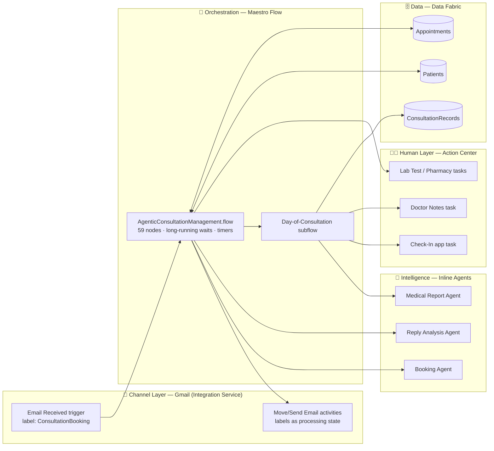

# Agentic Consultation Management — End-to-End Solution Design

**Author:** Vineeth Shenoy P · **Date:** 2026-07-19 · **Context:** UiPath Public Preview Challenge
**Source process:** `agentic_consultation_management.bpmn` · **Implementation:** UiPath Maestro Flow (`ConsultationSystem` solution)

---

## 1. Vision

A patient emails a clinic to book a consultation. From that single email, the system autonomously:

1. **Understands** the request (agent parses patient ID, date, time from free-form mail),
2. **Books** the appointment against clinic records (Data Fabric),
3. **Confirms** by mail and then **waits** — for the appointment day, a doctor emergency, or a patient reschedule/cancel,
4. **Orchestrates the day of consultation** — patient check-in (human task), doctor notes, medical report generation,
5. **Closes the loop** — lab test requests and pharmacy orders where needed, final status written back.

Humans stay in the loop exactly where judgment is needed (check-in, doctor notes, lab/pharmacy approval); agents handle language understanding; Maestro handles long-running state, timers, and compensation paths.

## 2. Architecture Overview



**Design principle:** every external interaction (mail, data, agent, human) is a swappable node behind a stable flow topology. The topology was validated first with mocks; each mock is now replaced in vertical slices without touching the control flow.

## 3. Layer-by-Layer Design

### 3.1 Channel layer — Gmail via Integration Service

Gmail **labels are the state machine of the inbox**:

| Label | Meaning |
|---|---|
| `ConsultationBooking` | Inbound booking requests (trigger source) |
| `Processed_ConsultationBooking` | Booking consumed by the flow |
| `PatientReplies` / `Processed_Replies` *(to create)* | Emergency-reschedule replies awaiting / consumed |

- **Trigger:** `email-received` (polling) on `ConsultationBooking` — **already live**.
- A Gmail **filter rule** ("subject contains Book Consultation → apply label") is part of the deployment runbook — without it the trigger never fires.
- **Activities:** `move-email` (already live for the trigger mail), `send-email` for confirmation / booking / reminder mails.
- Mail contract (v1, demo-friendly): subject `Book Consultation`, body lines `PatientID:… / Date:… / Time:…`. The Booking Agent makes this tolerant to free-form text later — the contract is a floor, not a ceiling.

### 3.2 Orchestration — the Maestro Flow (built, validated)

The BPMN maps onto the flow as follows; the interesting mappings are where BPMN constructs have no 1:1 Flow equivalent:

| BPMN construct | Flow realization | Status |
|---|---|---|
| Message start event | Gmail connector trigger | ✅ live |
| Event-based gateways ("wait for appointment day / patient reply") | Poll loop (Delay + check Script + `completionCondition`) → **upgrade path:** Gmail *wait-for-event* node (`uipath.connector.event.*`) racing a Delay timer | mocked check |
| Boundary message event on subprocess (doctor emergency on consultation day) | Emergency-watch poll loop running **in parallel** with the subflow; result evaluated at the join | mocked |
| 8h / 1h / 24h timers | Loop exhaustion (= timeout) / task SLA | in place |
| "Day of Consultation" subprocess | Subflow with 3 typed outcomes (`completed` / `abandoned` / `cancelled`) | mocked internals |
| Terminate end event | `core.logic.terminate` after subflow outcome check | ✅ |
| Inclusive gateway (tests and/or medicines) | Parallel fork → two decisions → join scripts → parallel merge | ✅ |

### 3.3 Intelligence — three inline agents (`uipath.agent.autonomous`)

| Agent | Input | Output (typed) | Tools | Guardrail |
|---|---|---|---|---|
| **Booking Agent** | trigger mail Subject + Body | `{patientId, date, time, valid, reason}` | Data Fabric lookup (patient exists? slot free?) | escalate to human task if `valid=false` — never guess a booking |
| **Reply Analysis Agent** | patient reply mail Body | `{intent: reschedule\|cancel\|confirm, newDate?, newTime?}` | none (pure classification) | low-confidence → treat as cancel + notify |
| **Medical Report Agent** | doctor notes + consultation record | `{report, testsNeeded, medsNeeded}` | Data Fabric read (patient history) | output stored as draft; doctor task approves |

Evals: the project already carries an eval scaffold (llm-judge + trajectory evaluators). Each agent gets an eval set from real sample mails before it replaces its mock — **evals are the regression gate for prompt changes**.

### 3.4 Human layer — Action Center

| Task | Type | SLA / escalation |
|---|---|---|
| Check-In | Action App (patient/front-desk) | 24h timeout → appointment `Abandoned` |
| Doctor Notes | Form task (doctor) | none — blocks completion |
| Lab Test Request | Approval task | routed only when `testsNeeded` |
| Pharmacy Order | Approval task | routed only when `medsNeeded` |

### 3.5 Data — Data Fabric entities

```text
Patients          (PatientID [PK], Name, Email, Phone)
Appointments      (AppointmentID [PK], PatientID [FK], Date, Time, Status, DoctorID)
ConsultationRecords (RecordID [PK], AppointmentID [FK], Notes, Report, TestsOrdered, MedsOrdered)
Status choice-set: Booked → Confirmed → CheckedIn → Completed
                          ↘ Rescheduled / CancelledByPatient / CancelledNoReply / Abandoned / Terminated
```

Every status transition in the flow is one `update record` call — the Appointments entity becomes the single source of truth a dashboard can sit on later.

## 4. Delivery Plan — vertical slices, demoable at every step

**Phase 0 — DONE.** BPMN → Flow skeleton, mock-first, `Status: Valid`, 59 nodes / 66 edges. Gmail trigger + move-to-processed live and debugged.

**Phase 1 — Booking intake slice (the demo).**
Booking Agent inline (parse mail → structured booking) → Data Fabric `Appointments` create → Gmail confirmation mail.
*Demo: send one mail, watch a record appear and a confirmation come back.* This is the smallest end-to-end proof of "agentic".

**Phase 2 — The waiting game. ✅ mostly built (2026-07-19).**
Reply Analysis Agent live (inline, classifies cancel/reschedule/confirm from the patient's reply, sourced via Gmail *Get Newest Email*); reschedule/cancel branches now write **real Appointment status** to Data Fabric (`CancelledByPatient` / `Rescheduled` / `CancelledNoReply` / `CancelledEmergency`) via 4 update-entity-record nodes keyed on `createAppointment1.output.Id`; reschedule confirmation mail sent for real. **Still simulated:** the *detection* of the reply/reminder/emergency events themselves — the poll loops with mock check-scripts remain (the approved script-based-loop stand-in). Two housekeeping mail-moves (`moveReplyMail`, `moveReminderMail`) stay mock because they need a real inbound message-id, which only exists once detection is real — see PM question #1 (wait-for-event race).

**Phase 3 — Day of consultation. ✅ mostly built (2026-07-19).**
The `dayOfConsult` subflow now receives typed context (`appointmentRecordId`, `patientId`, `patientEmail`, `appointmentDate`, `appointmentRecords`) from the parent; all three status writes are **real** Data Fabric updates (`CheckedIn` / `Cancelled` / `Abandoned`); the **Medical Report Agent** is live as the 3rd inline agent (pre-consultation brief from reason-for-visit + patient history → `report`/`recommendations`); a new **ConsultationRecords** entity is written after doctor notes; and `apptCompleted` writes `Completed` + `endTime` for real. **Still mocked:** Check-In and Doctor Notes — these are Action Apps (Action Center HITL), a separate product build outside the flow file; the mocks keep the happy path runnable.

**Phase 4 — Fulfilment + quality. 🔶 eval gate seeded (2026-07-19).**
The eval set (`eval-set-001`, entrypoint `emailReceived1`) now carries 3 booking-intake data points (clean contract mail, free-form phrasing, missing patient id) against the existing llm-judge/exact-match/trajectory evaluators — runs execute in Studio Web after upload (not yet run). Lab/pharmacy approval tasks remain mock for the same Action-App reason as Phase 3.

**BPMN-annotation realignment (2026-07-19).** Three divergences closed: (1) *Get All Records* is now a real Data Fabric **read** (`query-entity-records` on Appointments) feeding the Booking Agent — creation stays a separate explicit write; (2) the **Booking Agent now selects the time slot** (30-min slots, 09:00–17:00, conflict-avoidance + priority from patient history) instead of only parsing the mail; (3) *Send Booking Mail* now sends a **booking-format mail to the clinic's own trigger address**, spawning a fresh flow instance for the rescheduled appointment (BPMN's re-trigger semantics). Note the read sits *before* the agent (BPMN draws it after) — the agent can't use records it hasn't received; flagged for the PM discussion.

**Phase 5 — Hardening (post-challenge).**
Error ports on every connector node with compensation mails, per-node connections, deploy pipeline (`pack → publish → deploy`) — *only on explicit go*.

Each phase ends the same way: `validate` clean → `format` → commit → demo.

## 5. Questions for the UiPath PM (Preview Challenge)

1. **Event-based gateways:** Is there (or is there planned) a native *race-of-events* construct in Flow — N event waits + a timer, first one wins, others cancelled? Today we simulate with poll loops; a `wait-for-event` node exists but can several race with cancellation?
2. **Boundary-event semantics:** Can a subflow be interrupted from outside (BPMN boundary message event)? Our parallel-watch approximation can't cancel the subflow mid-task.
3. **Inline agent ↔ Data Fabric:** best-practice way to give an inline agent entity read access as a tool — direct DF tool, or wrap in an API workflow?
4. **Connector trigger filters:** any way to filter `email-received` on Subject (not just label) to drop the Gmail-filter prerequisite?
5. **Eval runs on inline agents:** recommended loop for prompt iteration against the eval sets from inside a Flow project?
6. **Timer fidelity:** recommended pattern for long waits (days) — is a Delay node durable/hibernated, or should we prefer scheduled triggers?

## 6. Risks & Mitigations

| Risk | Mitigation |
|---|---|
| Polling trigger latency (minutes) makes live demos awkward | Pre-labeled mail ready to drag into the label; simulations for the deep branches |
| Agent misparses free-form mail | Typed output schema + `valid` flag + human escalation path; eval set as gate |
| Poll-loop approximation diverges from BPMN semantics | Explicitly flagged; PM questions #1/#2; upgrade path to wait-for-event nodes |
| Shared Gmail connection across nodes (validator warning) | Accepted for demo (same account); split per node in Phase 5 |
| Long-running state across days | Maestro is built for this — but verify Delay durability (PM question #6) |
| `bookingAgent.valid=false` is not yet consumed — an unparseable mail still reaches the create step | Known gap, deliberate for demo scope; fix = decision node on `valid` routing to a human escalation task (Phase 4/5) |
| Self-addressed re-trigger mail may not fire the Gmail trigger (Gmail can skip filters on self-sent mail) | Verify with clinic mailbox; fallback = second address or label applied by the send itself |

## 7. Current State Snapshot (for the meeting)

- ✅ Full BPMN topology implemented and **validated** in one Maestro Flow (+ 1 subflow), pushed to [GitHub](https://github.com/Vineeth-03-Shenoy/consultation_system)
- ✅ Real Gmail **trigger** + **move-email** working end-to-end in debug
- ✅ Phase 1–3 built for real: 3 inline agents (Booking w/ slot selection, Reply Analysis, Medical Report), DF read + create + 8 status writes across Appointments/ConsultationRecords, confirmation + re-trigger mails
- ✅ Eval set seeded with 3 booking-intake data points (Studio Web run pending upload)
- 🔶 Still mocked (all for the same two product gaps): 4 Action-App HITL tasks (check-in, doctor notes, lab, pharmacy) and the 4 event-detection poll-check scripts (the wait-for-event race — PM question #1); 2 reply/reminder mail-moves blocked on real inbound message-ids from that detection
